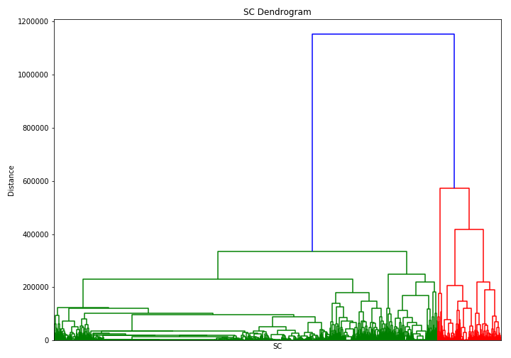

[](http://quantlet.de/)

## [](http://quantlet.de/) **SFM_Class_2018_Clustering_of_SContracts** [](http://quantlet.de/)

```yaml


Name of Quantlet:  SFM_Class_2018_Clustering_of_SContracts

 

Published in:      "Clustering & Classifying Smart Contracts & SFM_Class_2018"

  

Description:       "Clustering Ethereum Smart Contracts"

 

Keywords:          "hash, algorithm, crix, cryptocurrency, bitcoin, neural network, trading, fintech, Ethereum"


See also :         crix, econ_arima, econ_crix, econ_garch, econ_vola


Author:            Raphael Constantin Georg Reule, Elizaveta Zinovyeva, Rui Ren, Marvin Gauer

  

Submitted:         Wed, Jan 16 2019 by Elizaveta Zinovyeva

  

Datafile:          contracts_source_codes.csv

```




### IPYNB Code
```ipynb

{
 "cells": [
  {
   "cell_type": "markdown",
   "metadata": {},
   "source": [
    "# Clustering of Smart Contracts"
   ]
  },
  {
   "cell_type": "markdown",
   "metadata": {},
   "source": [
    "Place ./contracts_source_codes.csv' created in SFM_Class_2018_filter_SContracts to the root folder of this quantlet"
   ]
  },
  {
   "cell_type": "markdown",
   "metadata": {},
   "source": [
    "### Import modules"
   ]
  },
  {
   "cell_type": "code",
   "execution_count": null,
   "metadata": {},
   "outputs": [],
   "source": [
    "import json\n",
    "from pprint import pprint\n",
    "import pandas as pd\n",
    "import numpy as np\n",
    "from keras.preprocessing.text import Tokenizer\n",
    "from keras.preprocessing.sequence import pad_sequences\n",
    "\n",
    "from matplotlib import pyplot as plt\n",
    "from scipy.cluster.hierarchy import dendrogram, linkage\n",
    "import scipy.cluster.hierarchy as shc\n",
    "from scipy.cluster.hierarchy import fcluster\n",
    "\n",
    "from sklearn.decomposition import PCA\n",
    "from sklearn.neighbors import DistanceMetric\n",
    "from sklearn.manifold import TSNE\n",
    "from sklearn.cluster import KMeans\n",
    "\n",
    "from nltk.corpus import stopwords\n",
    "# additional set up\n",
    "%matplotlib inline\n",
    "np.set_printoptions(precision=5, suppress=True)\n",
    "pd.set_option('max_colwidth', -1)\n",
    "pd.set_option('max_rows', 200)"
   ]
  },
  {
   "cell_type": "markdown",
   "metadata": {},
   "source": [
    "### Read Data Set and Prepare"
   ]
  },
  {
   "cell_type": "code",
   "execution_count": null,
   "metadata": {},
   "outputs": [],
   "source": [
    "df = pd.read_csv('./contracts_source_codes.csv')\n",
    "df.dropna(subset=['comments'], inplace=True)\n",
    "df.dropna(subset=['contract_name'], inplace=True)\n",
    "df.dropna(subset=['comments'], inplace=True)\n",
    "develop = True # set to true if testing"
   ]
  },
  {
   "cell_type": "code",
   "execution_count": null,
   "metadata": {},
   "outputs": [],
   "source": [
    "def clean_text(text):\n",
    "    ## Remove stop words\n",
    "    stops = set(stopwords.words(\"english\"))\n",
    "    text = [w for w in text.split() if not w in stops and len(w)>=3]\n",
    "    text = \" \".join(text)\n",
    "    return(text)"
   ]
  },
  {
   "cell_type": "markdown",
   "metadata": {},
   "source": [
    "### Clustering on comments of the source code"
   ]
  },
  {
   "cell_type": "code",
   "execution_count": null,
   "metadata": {},
   "outputs": [],
   "source": [
    "# text preprocessing\n",
    "text = df.comments.apply(clean_text)\n",
    "tokenizer = Tokenizer(num_words=10000)\n",
    "tokenizer.fit_on_texts(text)\n",
    "train_X = tokenizer.texts_to_sequences(text)\n",
    "train_X = [np.unique(i) for i in train_X]\n",
    "train_X = pad_sequences(train_X, maxlen=200, padding='post')\n",
    "labels =  df.contract_name"
   ]
  },
  {
   "cell_type": "code",
   "execution_count": null,
   "metadata": {},
   "outputs": [],
   "source": [
    "plt.figure(figsize=(10, 7))  \n",
    "plt.title(\"SC Dendrogram\")  \n",
    "plt.xlabel('SC')\n",
    "plt.ylabel('Distance')\n",
    "Z = shc.linkage(train_X, method='ward')\n",
    "dend = shc.dendrogram(Z, labels=labels.values, p = 20, no_labels=True) \n",
    "plt.tight_layout()\n",
    "if not develop:\n",
    "    plt.savefig(f'./dendr_small.png', transparent=True)"
   ]
  },
  {
   "cell_type": "markdown",
   "metadata": {},
   "source": [
    "### Visualisation of Clusters using tSNE (t-distributed stochastic neighbor embedding)"
   ]
  },
  {
   "cell_type": "code",
   "execution_count": null,
   "metadata": {},
   "outputs": [],
   "source": [
    "tsne = TSNE(n_components=2)\n",
    "tsne.fit(train_X)\n",
    "X_t = tsne.fit_transform(train_X)"
   ]
  },
  {
   "cell_type": "code",
   "execution_count": null,
   "metadata": {},
   "outputs": [],
   "source": [
    "max_d = 7\n",
    "kmeans = KMeans(n_clusters=max_d, random_state=0).fit(X_t)\n",
    "kmeans.labels_"
   ]
  },
  {
   "cell_type": "code",
   "execution_count": null,
   "metadata": {},
   "outputs": [],
   "source": [
    "reverse_word_map = dict(map(reversed, tokenizer.word_index.items()))\n",
    "cluster_labels = {}  \n",
    "for i in range(0, max_d+1):\n",
    "    df_ = pd.DataFrame(columns = ['word', 'count'])\n",
    "    df_['word'], df_['count'] = np.unique(train_X[kmeans.labels_==i], return_counts=True)\n",
    "    df_ = df_.sort_values(by=['count'], ascending=False)\n",
    "    #print(df.head(20))\n",
    "    temp = []\n",
    "    for word in df_.word.values[1:10]:\n",
    "        temp.append(reverse_word_map[word])\n",
    "    cluster_labels[i] = ' '.join(temp)\n",
    "plt.figure(figsize=(20, 16))\n",
    "\n",
    "for i in range(0, max_d+1):\n",
    "    plt.scatter(X_t[kmeans.labels_==i,0], X_t[kmeans.labels_==i,1], label = cluster_labels[i])\n",
    "plt.legend(loc = 'upper left', prop={'size': 10})\n",
    "#plt.legend(loc='upper center', bbox_to_anchor=(1.45, 0.8), prop={'size': 10})\n",
    "plt.xlabel('Component 1')\n",
    "plt.ylabel('Component 2')\n",
    "plt.title(f'Scatter plot with clusters\\' amount = {max_d}')\n",
    "filename=f'./TSNE_on_{max_d}_clusters_comments.png'\n",
    "if not develop:\n",
    "    plt.savefig(filename, dpi=96, transparent=True)\n",
    "plt.gca()"
   ]
  },
  {
   "cell_type": "markdown",
   "metadata": {},
   "source": [
    "### Clustering on source code"
   ]
  },
  {
   "cell_type": "code",
   "execution_count": null,
   "metadata": {},
   "outputs": [],
   "source": [
    "def clean_text(text):\n",
    "    ## Remove stop words\n",
    "    stops = set(stopwords.words(\"english\"))\n",
    "    text = [w for w in text.split() if not w in stops and len(w)>=3]\n",
    "    text = \" \".join(text)\n",
    "    return(text)\n",
    "text = df.code_all_no_punct.apply(clean_text)\n",
    "\n",
    "# text preprocessing\n",
    "tokenizer = Tokenizer(num_words=10000)\n",
    "tokenizer.fit_on_texts(text)\n",
    "train_X = tokenizer.texts_to_sequences(text)\n",
    "train_X = [np.unique(i) for i in train_X]\n",
    "train_X = pad_sequences(train_X, maxlen=200, padding='post')\n",
    "labels =  df.contract_name"
   ]
  },
  {
   "cell_type": "code",
   "execution_count": null,
   "metadata": {},
   "outputs": [],
   "source": [
    "tsne = TSNE(n_components=2)\n",
    "tsne.fit(train_X)\n",
    "X_t = tsne.fit_transform(train_X)\n",
    "reverse_word_map = dict(map(reversed, tokenizer.word_index.items()))"
   ]
  },
  {
   "cell_type": "code",
   "execution_count": null,
   "metadata": {},
   "outputs": [],
   "source": [
    "max_d = 7\n",
    "kmeans = KMeans(n_clusters=max_d, random_state=0).fit(X_t)"
   ]
  },
  {
   "cell_type": "code",
   "execution_count": null,
   "metadata": {},
   "outputs": [],
   "source": [
    "cluster_labels = {}  \n",
    "for i in range(0, max_d+1):\n",
    "    df_ = pd.DataFrame(columns = ['word', 'count'])\n",
    "    df_['word'], df_['count'] = np.unique(train_X[kmeans.labels_==i], return_counts=True)\n",
    "    df_ = df_.sort_values(by=['count'], ascending=False)\n",
    "    #print(df.head(20))\n",
    "    temp = []\n",
    "    for word in df_.word.values[1:10]:\n",
    "        temp.append(reverse_word_map[word])\n",
    "    cluster_labels[i] = ' '.join(temp)\n",
    "\n",
    "plt.figure(figsize=(20, 16))\n",
    "for i in range(0, max_d+1):\n",
    "    plt.scatter(X_t[kmeans.labels_==i,0], X_t[kmeans.labels_==i,1], label = cluster_labels[i])\n",
    "plt.legend(loc = 'upper left', prop={'size': 10})\n",
    "#plt.legend(loc='upper center', bbox_to_anchor=(1.45, 0.8), prop={'size': 10})\n",
    "plt.xlabel('Component 1')\n",
    "plt.ylabel('Component 2')\n",
    "plt.title(f'Scatter plot with clusters\\' amount = {max_d}')\n",
    "filename=f'./TSNE_on_{max_d}_clusters_sourcecode.png'\n",
    "if not develop:\n",
    "    plt.savefig(filename, dpi=96, transparent=True)\n",
    "plt.gca()"
   ]
  }
 ],
 "metadata": {
  "kernelspec": {
   "display_name": "Python 3",
   "language": "python",
   "name": "python3"
  },
  "language_info": {
   "codemirror_mode": {
    "name": "ipython",
    "version": 3
   },
   "file_extension": ".py",
   "mimetype": "text/x-python",
   "name": "python",
   "nbconvert_exporter": "python",
   "pygments_lexer": "ipython3",
   "version": "3.6.7"
  }
 },
 "nbformat": 4,
 "nbformat_minor": 2
}

```

automatically created on 2019-01-16